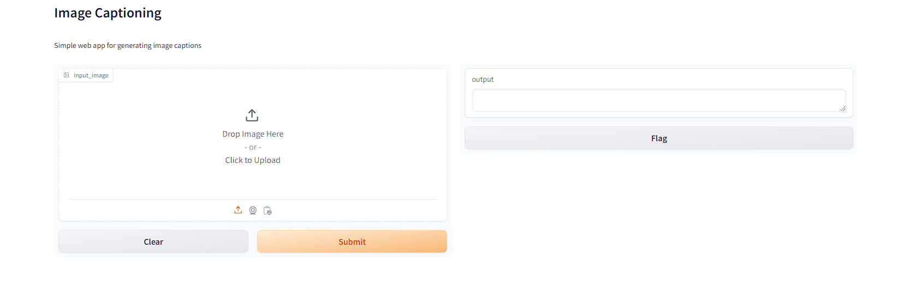
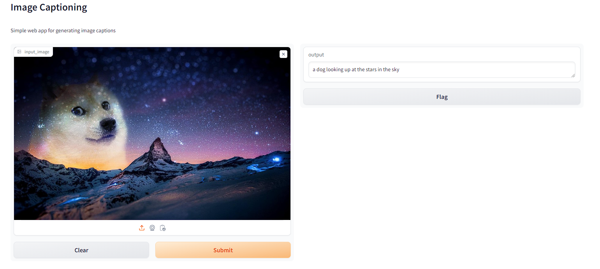

# Image Captioning App

### This app uses Gradio to create a simple interface and the BLIP model from Hugging Face's Transformers to generate captions for images provided

<figure>
    
    <figcaption>Image of Gradio interface</figcaption>
</figure>

<figure>
    
    <figcaption>Caption generated for imgage provided</figcaption>
</figure>
